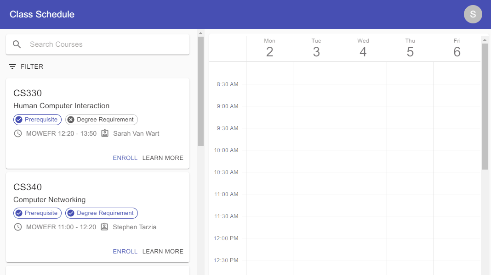

Team: Serif but better (Yifeng Chen, Xujia Zhang, Junlin Liu, Radin Marinov, Felix Peng)

Section: 65

# Better Than Caesar

## Problem & Related Work

### Problem & Motivation

This project tackles the problem that occurs when students attempt to plan out which classes they wish to take in the future while making sure that their plan fulfills all necessary degree requirements. Speaking from our own experiences as students at Northwestern, it’s a lot of manual work when planning out a schedule: classes may or may not be offered in a term, they may satisfy different or multiple degree requirements, and some may overlap in time as others. After finding such a schedule that exists, classes may fill up before registration, rendering the plan useless and thus having to create a new schedule. If this problem were addressed with an all-around schedule maker,, with the goal being that a student can easily find classes to take for each semester/quarter using a filter as well as other functionalities, students worldwide would be able to optimize their class schedules, thus allowing for additional opportunities for study to be available within the same amount of time a student spends at school. 

### Related Work

While it is possible to solve this problem manually, it takes a lot of careful planning and attention to detail, which may lead to mistakes. There currently exists websites which allow college students to input classes into a schedule, which can help with finding classes that do not have overlapping times. One such website that exists for Northwestern is serif.nu. serif.nu functions similarly to our proposed schedule suggestor in that it allows students to build their schedules in a way that is visually rich and easy to understand. However, it still requires a lot of manual input and searching from the user; one must know what they need to take and what is offered for the quarter before they can really take advantage of the functionality of serif.nu. Additionally, there exists systems (like the McCormick Advising System) which show your degree requirements and what classes may be allocated, but this doesn’t show when the classes that satisfy requirements can be taken, nor does it show a live view of classes currently available. As a result, the issue of schedules being difficult to make as a result of not knowing what classes one needs to take at what time remains unsolved. 

However, there is no one tool that currently exists that offers suggested schedule planning tailored to a student's degree requirements and their class history. The McCormick Advising System is a great place to model this schedule suggestor on, as it already contains a student’s degree requirements as well as their class history. The next step would be adding the suggestor into the system. Many aspects of the problem are conducive to a website, as there is already an example of a website (McCormick Advising System) which contains some aspects of the problem already. Basically most of the aspects of the problem are addressable via computing technology, as we already have examples of websites which perform some of the functionality we wish for (degree requirements, class scheduling, etc). 

Our schedule suggestor will begin by frontloading the manual input by the user and understanding what they've taken before, what major/minor programs they're enrolled in, and from there understand what classes still need to be taken. This will then be matched against filters such as the quarter of interest to help the user by showing courses they need to take when they're available. In addition, our initial hypothesis has led us to three features that we believe should be included. The first is that the website will first display all courses that are available for this quarter, and when the user selects one course, the website will filter courses and list all compatible courses. The second is that the website can also allow the user to look for more information by clicking on the course name, and then a dialogue will show the user more information about this course, including time, prerequisites, course type and lecturers. The user can also make their choice based on that information. Finally, the website can offer guidance for users to choose their course based on their career expectations. For example, for CS students, they can choose their interested fields, like Computer Vision, Software Development,etc. If the user selects Computer Vision, courses related to Computer Vision would be displayed. After a user marks all their favored courses, the website can create schedules based on the user's preference.

# User Research

The goal of our contextual inquiries and observations was to learn more about how our target audience felt about the current state of resources offered for class scheduling purposes.

Additionally, the basis of our pursuing this project rested on the assumption that building a class schedule using what is currently available for Northwestern students is confusing and messy for many. By asking people about their experience with finding courses and building a course schedule, we sought to validate these assumptions and to find out what they think could be improved about the process. If a lot of people had complaints or suggestions, then we could safely continue under the assumption that the current process for building course schedules was far from optimal.

Our research approach was to conduct contextual inquiries and observe users as they attempted to build and enroll in a sample course schedule, noting where users had difficulties or frustrations and where they were able to operate with ease. We decided to evaluate how much progress users could make towards building their course schedule within a given time limit of 20 minutes. We asked our users to ‘build’ their class schedule for the Spring 2020 quarter using the information for Spring 2019 courses. Within this time, we felt that we would be able to see if there are any particular pain points that people run into, as well as note anything that worked particularly well.

After observation, we asked the following questions:
1. Do you think Caesar/ Serif are useful? In what ways?
2. Where do you think Caesar/ Serif  should improve?
3. What features do you wish existed for your convenience?
4. What features or aspects of a product did you feel impeded your completion of the task?
5. What matters to you when you are selecting courses for the next quarter?
6. What factors do you consider when choosing alternative courses for a class that you can’t take during a specific quarter?

From our contextual inquiries and post-observation interviews, we found that generally, users in our target population had some grievances with the current state of tools and websites that they can use for searching for and enrolling in courses. Many people took issue with CAESAR’s repetitiveness, slow loading times, and inability to effectively compare classes and CTECs. Students we interviewed also felt that the information pertinent to course selection and enrollment was often spread out between CAESAR and the course or department websites, making it difficult to find everything one needed in a single page visit. Some of our users also reported having few to no difficulties using sites like CAESAR and Serif to select and enroll in courses, citing that they didn’t really mind switching between pages or that they already had a very clear idea of what they would be taking for each quarter. Many liked Serif’s clean design and responsiveness, but felt that its inability to actually enroll a user in classes was a big drawback.

Translated into needs and goals of our application, we came away from user research realizing that our website would need to be able to:

- Access or view the courses provided by user major, in addition to courses that may satisfy other degree requirements
- View if classes have conflicting schedules
- View feedback on courses (CTECS)

Less urgent needs included:

- Centralizing information that users like to have on hand when deciding whether - or not to register for a course
- Improving interface and response times
- Side-by-side course or CTEC comparisons

With these features in mind, our app would support first and foremost Northwestern students, and we would need to make sure that our feature set fully supports the needs of smaller student populations such as PhD students, transfers, and exchange students, to name a few. Within the scope of this project, we decided not to consider support for other university systems and their students.

# Paper Prototyping

## Interface

### Part 1: 

this part has a calendar to show all selected courses, course name, time and location will be displayed. And top-right is a user profile button, below is a search box and filter setting.

### Part 2:

this part is course overview card, it shows some basic information, like course name, course number and course time, and also provide a sight to some important information about courses, like whether the course is included in user’s program requirement, and if the user has met its prerequisites. An `Enroll` button enable user to enroll the course right now, and `Learn more` button will guide you to its course detail page.

### Part 3:

this is filter setting part, here user can set the interval that user wants to take class, and weekday filter is also provided for those who wants to have class on specific days. `In degree program` and `prerequisite fullfilled` are just functions as their name imply.

### Part 4:

This is course detail page, it contains basic course information, general feedback and student feedback. 

## User Testing

In our test video, user seems to be very happy about our design, we have 3 tasks for user, selecting course between a specific interval, selecting course satisfied your degree requirement, and selecting an easy course. It took user no more than 3 minutes to complete all the tasks, because user learned to use the filter quickly. So our concepts was perfectly understood by testers.

However, there are some places to be improved:

1. When apply the filter, user need a feedback to know the filter is set. In our demo, once user set any filter, it would be applied immediately but with no feedback, and because we have no ‘Confirm’ button on the filter menu, user might be confused how to apply the filter.
2. One tester suggest that we add a filter on the location information, like we can divide courses into North Campus course and South Campus course, so that user can realize how far they need to travel to take a class.

We solved these problem by:

1. For the first problem, we add a confirm button, when user click on confirm, they will think the filter is set.
2. For the location problem, we add more specific location information for each course, so that user can know whether the course is taken at north campus or south. 

# High-Fidelity Prototyping

## Components

### 1. Branding

We used Google's Material UI as the main design language of the application to make the user interface consistent. We adopt the concept of card everywhere in the application to split the app in different function areas. The following image shows the overall design of the application

### 2. Interactive Data Filter

In order to make it easier for the user to find a course, we implemented a search box and a data filter. All the filtering are happened immediately happened once the user changed the filter without further confirm. But we add a placebo apply button in filter, it's only function is close the filter menu. The following demo shows the interactive data filtering.

### 3. Custom Calendar

We made a custom calender to let the users view their selected courses to verify whether their are time conflict between selected courses. The user can also drop the course on the calender.

### 4. Data Visualization

In the course detail, we added student feedback on the average time spent on the courses as a pie chart. The student can easily know the workload of a particular course.

### 5. Responsive Design

To improve the usability on mobile devices, we did responsive design in our application, the course list will resize based on the width of the device and the calender will hide depend on the width of the device.

## User Task

Our user task include:

1. Choose a easy course in Computer Science for your next quarter.
    - The built in course detail and average time pie chart tell's the user the feedback of the course. The user can easily choose a easy course.
2. Choose 2 courses that are all in the morning for the next quarter.
    - The filter has a start time and end time, the user can easily filter the courses that are in the morning
3. Choose 2 courses that are in your degree requirement.
    - The filter can filter all the courses that are in your degree requirement and every course card have a `In Degree Requirement` badge in the course card. The user can easily choose a course that are in the degree requirement.
4. Choose 2 courses that you already fulfilled the prerequisite.
    - The filter can filter all the courses that the user already fulfilled the prerequisite, and every course card have a `Prerequisite fulfilled` badge in the course card. The user can easily choose a course the user already fulfilled the prerequisite.

# Link

[Github Repo](https://github.com/EECS-330-Schedule/Better-Than-Caesar)

[Online Demo](https://better-than-caesar.firebaseapp.com/)

Select courses freely, you can click `Learn more` on each courses to view their details

